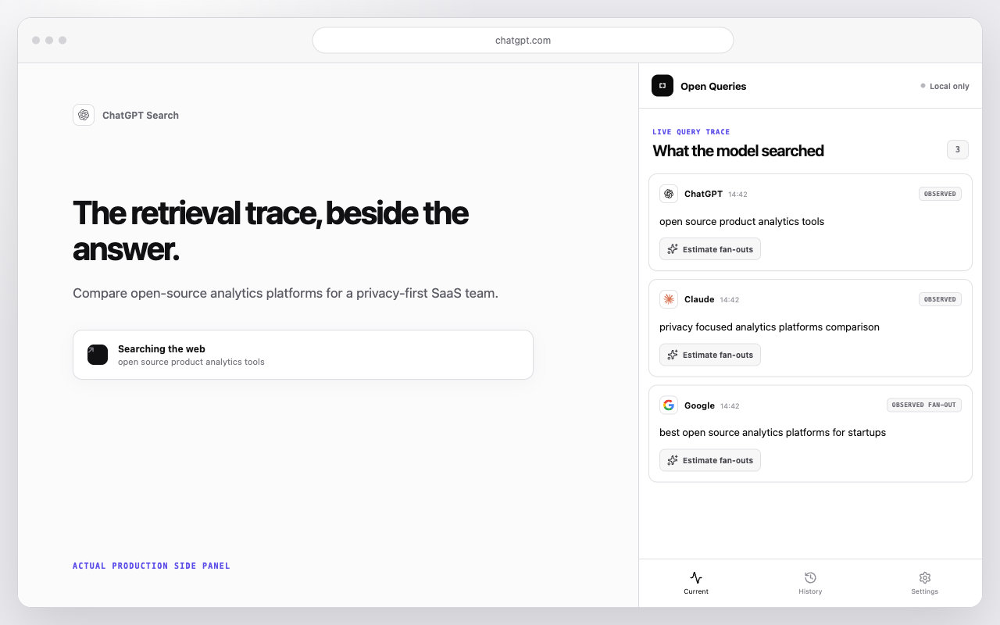

# Open Queries

**See the queries behind AI search.**

Open Queries is an open-source Chrome side-panel extension for inspecting the
web-search queries surfaced by ChatGPT, Claude and Google AI Overviews. It can
also reconstruct likely fan-out queries on demand, ranked with evidence from
the corresponding provider rather than a universal GPT scorer.

[Website](https://openqueries.org) ·
[Methodology](https://openqueries.org/methodology) ·
[Privacy](https://openqueries.org/privacy) ·
[Support](https://openqueries.org/support)



## Product boundary

- Captures only explicit search-tool UI on supported ChatGPT, Claude and Google
  Search pages.
- Never uses chat messages, titles, account identity or conversation URLs as a
  fallback.
- Keeps a 30-day trace in Chrome.
- Generates likely fan-outs only after a user request.
- Starts anonymous query contribution off; it remains a separate, optional
  control.
- Never mixes estimated fan-outs into observed-query aggregates.

## Provider-native estimation

| Surface | Generation and ranking evidence                                                                                                             |
| ------- | ------------------------------------------------------------------------------------------------------------------------------------------- |
| ChatGPT | GPT-5.6 Luna structured output and its own token log probabilities; ranked by token-normalized inverse perplexity                           |
| Claude  | 16 independent Claude Haiku 4.5 structured samples; ranked by inclusion frequency with a Wilson 95% confidence interval                     |
| Google  | 16 independent Gemini 3.1 Flash-Lite structured samples while the configured endpoint does not return usable chosen-token log probabilities |

The exact formulas, assumptions and endpoint capability checks are published in
the [mathematical methodology](https://openqueries.org/methodology) and
[architecture notes](docs/architecture.md).

## Monorepo

- `apps/extension` — Plasmo Manifest V3 side-panel extension.
- `apps/web` — vinext/Next website and Cloudflare Worker API.
- `packages/contracts` — strict versioned request and response schemas.
- `packages/query-core` — normalization, privacy filtering and score helpers.
- `packages/provider-icons` — shared official provider marks.

## Development

Requirements: Node.js 22.13+ and pnpm 8.10.5.

```bash
pnpm install
pnpm --filter @openqueries/web exec wrangler d1 migrations apply openqueries-db --local
pnpm check
```

Run the website and extension separately:

```bash
pnpm dev:web
pnpm dev:extension
```

Copy `apps/web/.env.example` to an ignored local environment file only when
testing provider calls. Provider keys must never enter source, extension bundles
or committed files.

The production Chrome package is generated at
`apps/extension/build/chrome-mv3-prod.zip`. The build gate evaluates the actual
bundled MV3 service worker and verifies that the toolbar action registers the
side panel before packaging.

## Contributing and security

Adapter changes must fail closed and include sanitized DOM fixtures. Read
[CONTRIBUTING.md](CONTRIBUTING.md) before opening a pull request. Report security
issues privately to [security@openqueries.org](mailto:security@openqueries.org),
not in a public issue.

## License and trademarks

AGPL-3.0-or-later. Open Queries is independent and is not affiliated with,
endorsed by or sponsored by OpenAI, Anthropic or Google. Their names and marks
remain the property of their respective owners.
